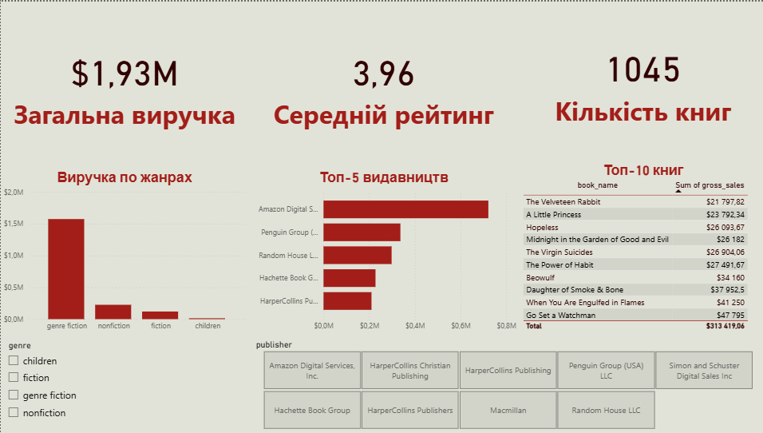
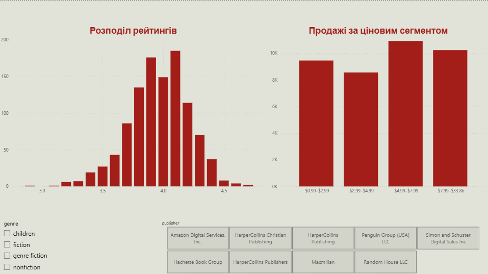

# Bookstore Analytics — Books Sales & Ratings

Наскрізний аналітичний проєкт: від сирого CSV до інтерактивного дашборду. Датасет — **[Books Sales and Ratings](https://www.kaggle.com/datasets/thedevastator/books-sales-and-ratings)** (Kaggle), ~1070 книг з даними про жанр, видавництво, ціну, виручку та читацькі рейтинги.

Мета — не просто "показати графіки", а пройти повний цикл аналітика: перевірка якості даних → бізнес-питання → SQL-аналіз → інтерактивний дашборд, з чесною фіксацією того, де перші висновки виявились хибними і довелось їх переглянути.

---

## 🎯 Бізнес-питання

1. Які жанри та видавництва приносять найбільше виручки?
2. Чи впливає рейтинг книги на її продажі?
3. Чи впливає ціна на кількість проданих копій?
4. Які книги — найуспішніші за виручкою?

---

## 🧹 Підготовка даних

Дані імпортовано в PostgreSQL. У процесі виявлено й виправлено кілька проблем:

| Проблема | Рішення |
|---|---|
| `Publishing Year` зберігався як float (`1975.0`) | Приведено до `INTEGER` |
| Зайва колонка `index` (артефакт pandas) | Видалено перед імпортом |
| 23 книги без назви (`book_name IS NULL`) | Залишені в агрегатах, виключені з рейтингів за назвою |
| Приховані регістрозалежні дублікати назв (`"Go Set a Watchman"` vs варіант із зайвим пробілом) | Виявлено через `TRIM`, виправлено в Power Query |
| 2 легітимних дублікати назв (`Persepolis`, `The Awakening`) | Перевірені вручну — різні видання, залишені як є |

---

## 📊 SQL-аналіз

Повні запити — у [`analysis.sql`](./analysis.sql). Ключові напрямки:

- Агрегація виручки по жанрах, видавництвах, епохах (по століттях, а не по роках — рік видання ≠ дата продажу)
- `CORR()` для перевірки лінійного звʼязку рейтинг/ціна vs продажі
- Групування по "кошиках" ціни та рейтингу з обов'язковою перевіркою розміру вибірки (`COUNT`) у кожній групі

---

## 📈 Дашборд (Power BI)

**Сторінка 1 — Огляд:** виручка по жанрах, топ-5 видавництв, топ-10 книг за виручкою, ключові метрики (загальна виручка, середній рейтинг, кількість книг).

**Сторінка 2 — Ціна та рейтинги:** розподіл рейтингів (з групуванням по 0.1), продажі по цінових сегментах (кастомна колонка `price_segment`, побудована на квантильних межах — не рівних за шириною діапазонах), слайсери по жанру й видавництву.

---

## 💡 Ключові висновки

- **Жанрова література домінує** — і за виручкою, і за кількістю продажів, з великим відривом від non-fiction, класичної прози та дитячої літератури
- **Amazon Digital Services — лідер серед "видавництв"** зі значним відривом від традиційних видавництв — ймовірно, це радше платформа дистрибуції для самвидаву, ніж класичне видавництво
- **Рейтинг книги практично не впливає на продажі** — підтверджено і кореляцією (≈0), і порівнянням груп за рейтингом
- **Звʼязок ціни з продажами нелінійний і помірний** — рівні за шириною цінові кошики спершу дали оманливий "пік" на вибірці з 6 книг; після переходу на квантильні сегменти (рівні за кількістю спостережень) картина виявилась значно спокійнішою: коливання в межах ~20% без різкого оптимуму
- **Рік видання ≠ рік продажу** — перша версія аналізу "виручка по роках" була методологічно некоректною; замінена на групування по епохах

### Про методологічну помилку з ціновими кошиками

Перша спроба (`pd.cut`-подібне групування на рівні за шириною діапазони) показала явний "пік" продажів у певному ціновому сегменті. При перевірці розміру вибірки виявилось, що цей сегмент складався лише з 6 книг — статистичний шум, а не закономірність. Перехід на квантильні сегменти (рівна кількість спостережень у кожній групі) дав надійніший і менш драматичний результат. Залишаю це в README свідомо — вважаю, що вміння виявити і виправити власну помилку важливіше, ніж показати тільки "красивий" фінальний результат.

---

## 🛠 Стек

`PostgreSQL` · `SQL` (JOIN, GROUP BY, підзапити) · `Power BI` (DAX, Power Query, slicers, conditional columns)